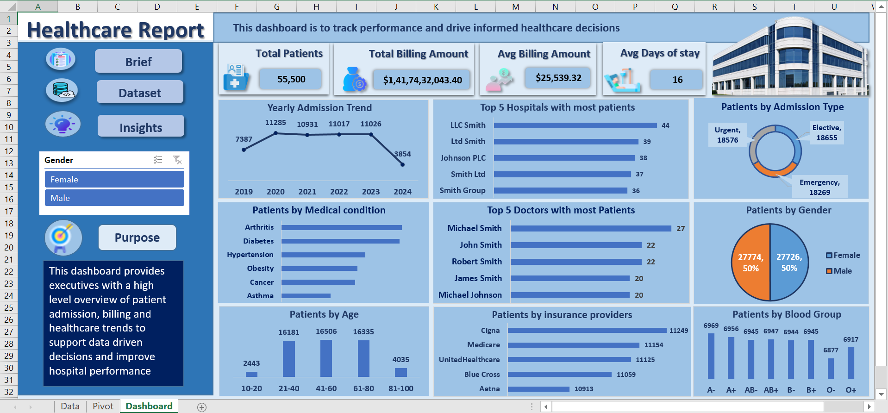

# 🏥 Healthcare Data Analysis | Excel Project

An interactive **Healthcare Data Analysis Dashboard built in Microsoft Excel** to analyze patient demographics, 
medical conditions, hospital admissions, treatment costs, insurance providers, and patient stay duration.

  

---

## 🎯 Business Problem

The healthcare dataset contains **55,500 patient records**, making it difficult to quickly understand patient demographics, 
admission patterns, medical conditions, treatment costs, and hospital performance.

### Goal

* How many patients were admitted each year?
* Which age groups have the highest number of patients?
* Which medical conditions are most common?
* What are the most common admission types?
* How are patients distributed by gender?
* Which insurance providers cover the most patients?
* Which hospitals and doctors have the highest patient counts?
* What is the average treatment cost and average length of stay?

---

## 👨‍💻 My Contribution

* Analyzed **55,500 patient records**
* Prepared and structured healthcare data for analysis
* Created PivotTables for patient and healthcare analysis
* Analyzed patient demographics and admission patterns
* Calculated key healthcare KPIs
* Analyzed medical conditions, insurance providers, hospitals, and doctors
* Created visualizations and an interactive dashboard
* Converted raw healthcare data into meaningful business insights

---

## 🛠️ Tools & Methodology

**Tool:** Microsoft Excel

### Techniques Used

`Data Preparation → PivotTables → KPI Analysis → Data Visualization → Dashboard → Insights`

---

# 📊 Key Performance Indicators

| KPI                       |          Value |
| ------------------------- | -------------: |
| 👥 Total Patients         |     **55,500** |
| 💰 Total Treatment Cost   |     **$1.42B** |
| 💵 Average Treatment Cost | **$25,539** |
| 🛏️ Average Days of Stay  | **16 days** |

---

# 💡 Key Insights

## 📅 1. Patient Admissions Increased Significantly in 2020
**Insight:** 2020 recorded the highest number of patients in the analyzed data, while 2024 had the lowest number.

---

## 👥 2. 41–60 Age Group Has the Highest Patient Count
**Insight:** Patients aged **41–60** represent the largest age group in the dataset.

---

## 🩺 3. Arthritis Is the Most Common Medical Condition
**Insight:** Arthritis has the highest number of patients, closely followed by Diabetes and Hypertension.

---

## 🚑 4. Elective Admissions Are the Most Common
**Insight:** Elective admissions represent the largest admission category in the dataset.

---

## 🚻 5. Gender Distribution Is Almost Even
**Insight:** The patient population has an almost equal distribution between male and female patients.

---

## 🏥 6. Insurance Coverage Is Relatively Balanced
**Insight:** Cigna has the highest number of patients in the analyzed dataset, while Aetna has the lowest.

---

## 💰 7. Overall Treatment Cost

The analysis shows:

* **Total Treatment Cost:** $1.42B
* **Average Treatment Cost:** $25,539.32
* **Average Days of Stay:** 15.51 days

**Insight:** The dashboard provides a centralized view of treatment costs and patient stay duration, helping identify overall healthcare utilization patterns.

---

# 🏆 Top Hospitals & Doctors

### Top 5 Hospitals by Patient Count

| Hospital    | Patients |
| ----------- | -------: |
| LLC Smith   |       44 |
| Ltd Smith   |       39 |
| Johnson PLC |       38 |
| Smith Ltd   |       37 |
| Smith Group |       36 |

### Top Doctors by Patient Count

The analysis also identifies doctors with the highest patient counts, including **Michael Smith, John Smith, Robert Smith, James Smith, and Michael Johnson**.

---

# 🚀 Business Value Created

This project transforms **55,500 patient-level records into a centralized healthcare analytics dashboard**.

It enables stakeholders to:

* Monitor patient admission trends
* Understand patient demographics
* Identify common medical conditions
* Analyze admission types
* Monitor treatment costs
* Compare insurance providers
* Identify hospitals and doctors with higher patient volumes
* Understand average patient stay duration

---

# 🚧 Challenges Faced

* Handling a large dataset containing **55,500 patient records**
* Summarizing patient-level information into meaningful KPIs
* Analyzing multiple healthcare dimensions simultaneously
* Organizing categorical data such as medical conditions, insurance providers, and admission types
* Presenting multiple insights in a clear dashboard format

### Solution

I used **Excel PivotTables, calculated metrics, KPI analysis, and data visualizations** to transform the raw healthcare dataset into an easy-to-understand analytical dashboard.

---

# 🧠 Skills Demonstrated

**Excel • Healthcare Data Analysis • Data Cleaning • PivotTables • KPI Analysis • Data Visualization • Dashboard Design • Statistical Analysis • Business Insights • Data Interpretation**

---

## ⭐ Project Outcome

The project demonstrates how Excel can be used to transform large healthcare datasets into **structured insights and decision-support dashboards** for understanding patient trends, healthcare utilization, and treatment costs.

### ⭐ If you found this project interesting, consider giving the repository a star!
